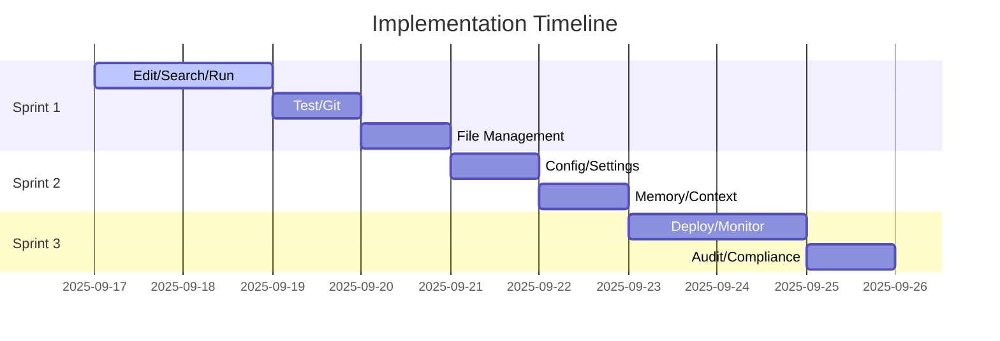

# 📋 Plato TUI Implementation Workflow

**Generated**: September 16, 2025
**Strategy**: Systematic with Agile Sprints
**Target**: Achieve 100% command implementation from current 65.2%

## 🎯 Executive Summary

Current state analysis reveals a **significant gap** between claimed and actual implementation:
- **Claimed**: 100% complete (46/46 commands)
- **Reality**: 65.2% working (30/46 commands)
- **Critical Gap**: 15 non-working commands including 9 essential development commands

This workflow provides a systematic path to achieve true 100% implementation through 3 structured sprints.

---

## 📊 Current State Analysis

### Working vs Non-Working Commands
```
┌─────────────────────────────────────┐
│  Status          │ Count │ Percent  │
├──────────────────┼───────┼──────────┤
│  ✅ Working      │  30   │  65.2%   │
│  ❌ Not Working  │  15   │  32.6%   │
│  ⚠️ Has Errors   │   1   │   2.2%   │
└─────────────────────────────────────┘
```

### Critical Missing Categories
1. **Development Commands** (9) - File manipulation, essential for Claude Code parity
2. **Core Commands** (2) - Configuration management
3. **Enterprise Commands** (4) - Advanced deployment features

---

## 🚀 Sprint 1: Critical Development Commands
**Duration**: 3-5 days
**Goal**: Restore Claude Code parity for development workflows

### Phase 1.1: File Manipulation Core (Day 1-2)

#### Task 1.1.1: Implement `/edit` Command
```typescript
Priority: CRITICAL
Dependencies: File system access, pattern matching
Implementation:
  1. Check if command router recognizes /edit
  2. Locate existing stub in src/slash/commands.ts
  3. Import native edit tool from src/tools/native/
  4. Wire execute handler to native tool
  5. Test with sample file edits
  6. Handle errors and edge cases
```

#### Task 1.1.2: Implement `/search` Command
```typescript
Priority: CRITICAL
Dependencies: Grep/ripgrep integration
Implementation:
  1. Verify search tool exists in native tools
  2. Create execute handler with pattern support
  3. Handle regex and literal search modes
  4. Implement result formatting
  5. Test across file types
```

#### Task 1.1.3: Implement `/run` Command
```typescript
Priority: CRITICAL
Dependencies: Shell execution, security validation
Implementation:
  1. Import bash tool from native tools
  2. Add security checks for dangerous commands
  3. Implement timeout and resource limits
  4. Stream output to user
  5. Handle exit codes properly
```

### Phase 1.2: Development Workflow (Day 2-3)

#### Task 1.2.1: Implement `/test` Command
```typescript
Priority: CRITICAL
Implementation:
  1. Detect test framework (Jest, Mocha, etc.)
  2. Execute test runner with proper args
  3. Parse and format test results
  4. Handle coverage reports
```

#### Task 1.2.2: Implement `/git` Command
```typescript
Priority: CRITICAL
Implementation:
  1. Support common git operations
  2. Parse git output for user-friendly display
  3. Handle authentication prompts
  4. Implement safety checks for destructive ops
```

### Phase 1.3: File Management (Day 3-4)

#### Tasks 1.3.1-4: Implement `/browse`, `/create`, `/delete`, `/move`
```typescript
Priority: HIGH
Parallel Implementation:
  - browse: List files with navigation
  - create: Create files/directories with templates
  - delete: Safe deletion with confirmation
  - move: Move/rename with conflict handling
```

### Sprint 1 Deliverables
- [ ] All 9 development commands working
- [ ] Integration tests passing
- [ ] Claude Code parity achieved
- [ ] Documentation updated

---

## 🔧 Sprint 2: Core Configuration Commands
**Duration**: 2-3 days
**Goal**: Enable system configuration and management

### Phase 2.1: Configuration Management (Day 1)

#### Task 2.1.1: Implement `/config` Command
```typescript
Priority: HIGH
Implementation:
  1. Load configuration from .plato/config.json
  2. Implement get/set/list subcommands
  3. Validate configuration values
  4. Handle nested configuration keys
  5. Persist changes to disk
```

#### Task 2.1.2: Implement `/settings` Command
```typescript
Priority: HIGH
Implementation:
  1. User preferences management
  2. Theme and UI settings
  3. Editor preferences
  4. Sync with config system
```

### Phase 2.2: Session Management (Day 2)

#### Task 2.2.1: Fix `/memory` Command
```typescript
Priority: MEDIUM
Current: Shows placeholder data
Fix:
  1. Connect to actual memory system
  2. Display real conversation history
  3. Implement memory search
  4. Add export functionality
```

#### Task 2.2.2: Fix `/context` Command
```typescript
Priority: MEDIUM
Current: Shows zeros
Fix:
  1. Connect to token counting system
  2. Calculate actual token usage
  3. Show context window utilization
  4. Add cost estimation
```

### Sprint 2 Deliverables
- [ ] Configuration system fully functional
- [ ] Session management working
- [ ] Settings persistence
- [ ] Memory and context tracking

---

## 🏢 Sprint 3: Enterprise Commands
**Duration**: 3-4 days
**Goal**: Complete enterprise-grade features

### Phase 3.1: Deployment & Monitoring (Day 1-2)

#### Task 3.1.1: Implement `/deploy` Command
```typescript
Priority: MEDIUM
Implementation:
  1. Support multiple deployment targets
  2. Integration with CI/CD pipelines
  3. Deployment status tracking
  4. Rollback capabilities
```

#### Task 3.1.2: Implement `/monitor` Command
```typescript
Priority: MEDIUM
Implementation:
  1. System resource monitoring
  2. Performance metrics display
  3. Alert configuration
  4. Integration with monitoring services
```

### Phase 3.2: Security & Compliance (Day 2-3)

#### Task 3.2.1: Implement `/audit` Command
```typescript
Priority: LOW
Implementation:
  1. Security audit trails
  2. Command history analysis
  3. Permission audit reports
  4. Compliance checking
```

#### Task 3.2.2: Implement `/compliance` Command
```typescript
Priority: LOW
Implementation:
  1. Compliance rule checking
  2. Report generation
  3. Policy enforcement
  4. Violation tracking
```

### Sprint 3 Deliverables
- [ ] All enterprise commands implemented
- [ ] Security features complete
- [ ] Monitoring integration
- [ ] 100% command completion achieved

---

## 🔄 Implementation Strategy

### Systematic Approach

1. **Discovery Phase** (Per Command)
   - Locate existing stub in src/slash/commands.ts
   - Check for native tool availability
   - Review test requirements

2. **Implementation Phase**
   - Follow template structure
   - Import required dependencies
   - Implement core logic
   - Add error handling

3. **Testing Phase**
   - Unit tests for command logic
   - Integration tests with CLI
   - Manual testing in dev environment
   - Update test documentation

4. **Documentation Phase**
   - Update command help text
   - Add usage examples
   - Update COMMANDS.md
   - Fix tofix.md status

### Parallel Processing Opportunities



---

## 🧪 Quality Gates

### Per-Command Validation
- [ ] Command recognized by router
- [ ] Execute handler returns proper format
- [ ] Error handling covers edge cases
- [ ] Help text is comprehensive
- [ ] Integration test passes

### Per-Sprint Validation
- [ ] All commands in sprint working
- [ ] No regression in existing commands
- [ ] Test coverage maintained >95%
- [ ] TypeScript compilation clean
- [ ] Documentation updated

### Final Validation
- [ ] All 46 commands functional
- [ ] Claude Code parity achieved
- [ ] Enterprise features complete
- [ ] Performance benchmarks met
- [ ] Production ready

---

## 🎯 Success Metrics

### Immediate Goals (Sprint 1)
- **Commands Working**: 30 → 39 (84.8%)
- **Claude Parity**: 0% → 100%
- **Dev Workflow**: Blocked → Enabled

### Mid-term Goals (Sprint 2)
- **Commands Working**: 39 → 41 (89.1%)
- **Configuration**: Non-functional → Complete
- **Session Management**: Broken → Working

### Final Goals (Sprint 3)
- **Commands Working**: 41 → 46 (100%)
- **Enterprise Features**: Missing → Complete
- **Overall Completion**: 65.2% → 100%

---

## 🚨 Risk Mitigation

### Technical Risks
1. **Native tool integration issues**
   - Mitigation: Fallback to direct implementation
   - Alternative: Use child_process for shell commands

2. **Command router conflicts**
   - Mitigation: Test each command in isolation
   - Alternative: Refactor router if needed

3. **TypeScript compilation errors**
   - Mitigation: Use string concatenation (no template literals)
   - Alternative: Type assertions where needed

### Schedule Risks
1. **Complexity underestimation**
   - Mitigation: Buffer time between sprints
   - Alternative: Prioritize critical commands

2. **Testing reveals more issues**
   - Mitigation: Fix-as-you-go approach
   - Alternative: Dedicated bug fix sprint

---

## 📝 Implementation Checklist

### Pre-Implementation
- [x] Analyze current state
- [x] Identify missing commands
- [x] Create implementation workflow
- [ ] Set up development environment
- [ ] Review native tools availability

### Sprint 1 Checklist
- [ ] `/edit` implemented and tested
- [ ] `/search` implemented and tested
- [ ] `/run` implemented and tested
- [ ] `/test` implemented and tested
- [ ] `/git` implemented and tested
- [ ] `/browse` implemented and tested
- [ ] `/create` implemented and tested
- [ ] `/delete` implemented and tested
- [ ] `/move` implemented and tested

### Sprint 2 Checklist
- [ ] `/config` implemented and tested
- [ ] `/settings` implemented and tested
- [ ] `/memory` fixed and tested
- [ ] `/context` fixed and tested

### Sprint 3 Checklist
- [ ] `/deploy` implemented and tested
- [ ] `/monitor` implemented and tested
- [ ] `/audit` implemented and tested
- [ ] `/compliance` implemented and tested

### Post-Implementation
- [ ] All tests passing
- [ ] Documentation complete
- [ ] Performance validated
- [ ] Production deployment ready
- [ ] Celebration! 🎉

---

## 🔗 Dependencies & Resources

### Key Files
- `src/slash/commands.ts` - Command registry
- `src/commands/router.ts` - Command routing
- `src/tools/native/` - Native tool implementations
- `src/cli.ts` - CLI entry point

### Testing Commands
```bash
# Test individual command
echo "/command args" | npx tsx src/cli.ts --cli

# Run test suite
npm test

# Check implementation status
grep "execute:" src/slash/commands.ts | grep -c "async"
```

### Documentation to Update
- `docs/COMMANDS.md` - Command reference
- `README.md` - Feature list
- `tofix.md` - Status tracking
- `CHANGELOG.md` - Version updates

---

## 🎬 Next Actions

1. **Immediate** (Today):
   - Start Sprint 1 implementation
   - Begin with `/edit` command
   - Set up testing environment

2. **Tomorrow**:
   - Complete file manipulation commands
   - Start development workflow commands

3. **This Week**:
   - Complete Sprint 1
   - Begin Sprint 2
   - Update documentation

4. **Next Week**:
   - Complete all sprints
   - Final testing and validation
   - Prepare for deployment

---

**Workflow Generated by**: /sc:workflow Analysis
**Confidence Level**: High (based on concrete test results)
**Estimated Completion**: 8-12 days with focused effort