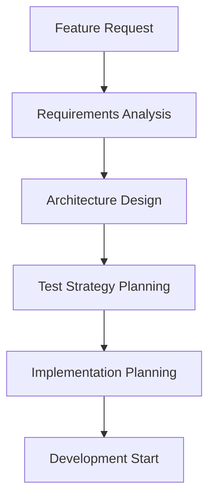

# Plato Development Methodology

## Overview

This document outlines the complete development methodology for the Plato project, covering all patterns, practices, and procedures developed across multiple sessions. It serves as the definitive guide for maintaining code quality, testing standards, and development workflows.

## Table of Contents

1. [Development Philosophy](#development-philosophy)
2. [Architecture Principles](#architecture-principles)
3. [Quality Standards](#quality-standards)
4. [Testing Methodology](#testing-methodology)
5. [Development Workflow](#development-workflow)
6. [Code Standards](#code-standards)
7. [Documentation Requirements](#documentation-requirements)
8. [Performance Standards](#performance-standards)
9. [Security Guidelines](#security-guidelines)
10. [Accessibility Requirements](#accessibility-requirements)

## Development Philosophy

### Core Principles

**1. Quality First**
- Every code change must maintain or improve overall quality
- Comprehensive testing is required, not optional
- Performance and accessibility are first-class requirements
- Security considerations are integrated from the start

**2. Evidence-Based Development**
- All architectural decisions backed by measurable criteria
- Performance claims validated through benchmarking
- Code quality measured through comprehensive metrics
- User experience validated through accessibility testing

**3. Systematic Approach**
- Consistent patterns applied across all components
- Standardized workflows for all development activities
- Comprehensive documentation maintained with code changes
- Regular quality audits and improvements

**4. Long-Term Maintainability**
- Code written for future developers, not just immediate needs
- Clear separation of concerns and modular architecture
- Comprehensive test coverage for confident refactoring
- Documentation that enables effective knowledge transfer

### Development Values

**Clarity over Cleverness**
- Simple, understandable solutions preferred
- Complex optimizations require clear documentation
- Code should be self-documenting where possible
- Architecture should be explainable to new team members

**Reliability over Features**
- Stable, well-tested functionality over rapid feature addition
- Graceful error handling and recovery mechanisms
- Comprehensive edge case handling
- Performance consistency across different environments

**Accessibility over Aesthetics**
- Universal usability takes precedence over visual design
- WCAG 2.1 AA compliance as minimum standard
- Keyboard navigation support for all functionality
- Screen reader compatibility maintained throughout

## Architecture Principles

### System Design

**1. Layered Architecture**
```
┌─────────────────────────────────────────────┐
│ Presentation Layer (TUI Components)         │
├─────────────────────────────────────────────┤
│ Application Layer (Orchestrator)            │
├─────────────────────────────────────────────┤
│ Domain Layer (Business Logic)               │
├─────────────────────────────────────────────┤
│ Infrastructure Layer (Providers, Storage)   │
└─────────────────────────────────────────────┘
```

**2. Dependency Management**
- Dependencies flow inward (higher layers depend on lower layers)
- External dependencies isolated at infrastructure layer
- Domain layer remains independent of external concerns
- Clean interfaces between all layers

**3. Component Isolation**
- Each component has single, well-defined responsibility
- Components communicate through well-defined interfaces
- Minimal coupling between components
- High cohesion within component boundaries

**4. State Management**
- Centralized state management where appropriate
- Local state for component-specific concerns
- Immutable state patterns where beneficial
- Clear state ownership and mutation policies

### Integration Patterns

**1. Provider Pattern**
- Uniform interface for external service integration
- Configurable provider selection at runtime
- Graceful degradation when providers unavailable
- Consistent error handling across providers

**2. Tool Bridge Pattern**
- Standard interface for external tool integration
- Permission-based access control for tools
- Comprehensive error handling and recovery
- Tool capability discovery and validation

**3. Memory Management Pattern**
- Persistent storage with intelligent compaction
- Cross-session continuity with performance optimization
- Configurable memory policies and limits
- Automatic cleanup and resource management

## Quality Standards

### Code Quality Metrics

**1. Test Coverage Requirements**
- **Statements**: Minimum 75%, Target 85%
- **Branches**: Minimum 65%, Target 80%
- **Functions**: Minimum 70%, Target 85%
- **Lines**: Minimum 75%, Target 85%

**2. New Code Requirements**
- **Unit Test Coverage**: Minimum 90%
- **Critical Path Coverage**: 100%
- **Error Handling Coverage**: Minimum 80%
- **Public API Documentation**: 100%

**3. Code Complexity Limits**
- **Cyclomatic Complexity**: Maximum 10 per function
- **Function Length**: Maximum 50 lines (excluding comments)
- **File Length**: Maximum 500 lines (excluding comments)
- **Parameter Count**: Maximum 5 per function

**4. Performance Requirements**
- **Input Latency**: <50ms target, <100ms maximum
- **Memory Usage**: <50MB idle, efficient growth patterns
- **Test Execution**: Unit tests <10s, Integration tests <30s
- **Build Time**: <30s for incremental, <120s for full build

### Quality Gates

**1. Pre-Commit Gates**
- TypeScript compilation must succeed
- All linting rules must pass
- Code formatting must be consistent
- Unit tests must pass

**2. Pre-Merge Gates**
- All automated tests must pass
- Code review approval required
- Performance benchmarks must not regress
- Documentation updates completed

**3. Release Gates**
- Full test suite execution
- Performance validation
- Accessibility compliance verification
- Security audit completion

## Testing Methodology

### Testing Strategy

**1. Test Pyramid Structure**
```
         ┌─────────────────────┐
         │   E2E Tests (Few)   │
         └─────────────────────┘
       ┌─────────────────────────┐
       │ Integration Tests (Some) │
       └─────────────────────────┘
     ┌───────────────────────────────┐
     │    Unit Tests (Many)          │
     └───────────────────────────────┘
```

**2. Testing Categories**

**Unit Tests (70% of test suite)**
- Fast execution (<10s total)
- Isolated component testing
- Comprehensive edge case coverage
- High reliability and deterministic results

**Integration Tests (25% of test suite)**
- Cross-component interaction testing
- Data flow validation
- Error propagation testing
- Realistic scenario validation

**End-to-End Tests (5% of test suite)**
- Complete user workflow testing
- Performance validation
- Cross-browser/terminal compatibility
- Accessibility compliance validation

### Test Implementation Standards

**1. Test Organization**
```typescript
describe("Component/System Name", () => {
  describe("Feature Group", () => {
    beforeEach(() => {
      // Setup for test group
    });

    test("should describe expected behavior", () => {
      // Arrange
      // Act
      // Assert
    });
  });
});
```

**2. Mock Strategy**
- Mock at module boundaries
- Use factory functions for test data
- Clear mocks between tests
- Document complex mock setups

**3. Assertion Patterns**
```typescript
// Specific assertions preferred
expect(result).toBe("expected value");
expect(result).toEqual({ expected: "object" });

// Avoid generic assertions
expect(result).toBeTruthy(); // Too generic
expect(result).toBeDefined(); // Too generic
```

**4. Error Testing**
```typescript
// Test error conditions explicitly
expect(() => functionCall()).toThrow("Expected error message");
expect(async () => asyncCall()).rejects.toThrow(ExpectedError);
```

### Test Quality Assurance

**1. Test Reliability**
- Tests must pass consistently (>99% success rate)
- No flaky tests allowed in main branch
- Deterministic results across environments
- Clear failure messages for debugging

**2. Test Performance**
- Unit tests must execute quickly (<1s per test file)
- Integration tests have reasonable timeouts (15s default)
- Memory cleanup verified between tests
- No resource leaks in test execution

**3. Test Maintenance**
- Tests updated with feature changes
- Obsolete tests removed promptly
- Test utilities kept up to date
- Regular test suite performance review

## Development Workflow

### Feature Development Process

**1. Planning Phase**


**2. Implementation Phase**
- Create feature branch from main
- Implement functionality with comprehensive tests
- Follow established code patterns and conventions
- Document changes as development proceeds

**3. Quality Assurance Phase**
- Run complete test suite locally
- Verify performance requirements
- Check accessibility compliance
- Update documentation as needed

**4. Integration Phase**
- Submit pull request with detailed description
- Address code review feedback
- Ensure CI pipeline passes
- Merge after all quality gates pass

### Version Control Patterns

**1. Branch Strategy**
- **main**: Production-ready code
- **feature/***: Individual feature development
- **bugfix/***: Bug fixes and patches
- **docs/***: Documentation-only changes

**2. Commit Standards**
```
<type>(<scope>): <subject>

<body>

<footer>
```

**Types**: feat, fix, docs, style, refactor, perf, test, chore

**3. Pull Request Requirements**
- Descriptive title and detailed description
- Test evidence and coverage information
- Performance impact assessment
- Breaking changes documentation

### Continuous Integration

**1. Automated Checks**
- TypeScript compilation
- Lint rule enforcement
- Automated test execution
- Performance benchmark validation

**2. Quality Metrics**
- Test coverage reporting
- Code complexity analysis
- Performance regression detection
- Security vulnerability scanning

**3. Deployment Gates**
- All tests must pass
- Performance requirements met
- Security audit completion
- Documentation updates verified

## Code Standards

### TypeScript Standards

**1. Type Safety**
- Strict mode enabled across project
- Explicit typing for public APIs
- Avoid `any` type usage
- Use union types for known variations

**2. Code Organization**
```typescript
// File structure
import statements (external first, then internal)
type/interface definitions
constants
private functions
exported functions/classes
default export (if applicable)
```

**3. Naming Conventions**
- **Variables/Functions**: camelCase
- **Types/Interfaces**: PascalCase
- **Constants**: SCREAMING_SNAKE_CASE
- **Files**: kebab-case for components, camelCase for utilities

**4. Function Design**
```typescript
// Good: Single responsibility, clear interface
function parseUserInput(input: string): ParsedInput {
  // Implementation
}

// Avoid: Multiple responsibilities, unclear interface
function handleStuff(data: any): any {
  // Implementation
}
```

### React/Ink Standards

**1. Component Structure**
```typescript
interface ComponentProps {
  // Props interface
}

export function Component({ prop1, prop2 }: ComponentProps) {
  // State declarations
  // Effect hooks
  // Handler functions
  // Render logic
}
```

**2. State Management**
- Use appropriate state granularity
- Minimize state duplication
- Use effects for side effects only
- Clear dependency arrays for effects

**3. Performance Patterns**
- Use `useMemo` for expensive computations
- Use `useCallback` for event handlers passed as props
- Minimize re-renders through proper state design
- Profile components for performance bottlenecks

### Error Handling Standards

**1. Error Classification**
```typescript
// System errors (recoverable)
class SystemError extends Error {
  constructor(message: string, public readonly code: string) {
    super(message);
  }
}

// User errors (validation, input)
class UserError extends Error {
  constructor(message: string, public readonly field?: string) {
    super(message);
  }
}
```

**2. Error Recovery**
- Graceful degradation for non-critical errors
- User-friendly error messages
- Comprehensive error logging
- Recovery actions where appropriate

**3. Error Testing**
- Test all error conditions
- Verify error messages and types
- Test error recovery mechanisms
- Document expected error scenarios

## Documentation Requirements

### Code Documentation

**1. API Documentation**
```typescript
/**
 * Brief description of function purpose
 *
 * Detailed description of functionality, including any side effects,
 * performance characteristics, or important behavioral notes.
 *
 * @param param1 - Description of parameter and constraints
 * @param param2 - Description of parameter and valid values
 * @returns Description of return value and possible variations
 * @throws {ErrorType} Condition under which error is thrown
 *
 * @example
 * ```typescript
 * const result = functionName("example", { option: true });
 * console.log(result); // Expected output
 * ```
 */
```

**2. File-Level Documentation**
```typescript
/**
 * @fileoverview Brief description of file purpose
 *
 * Detailed description of module functionality, architecture decisions,
 * and integration patterns. Include any security considerations or
 * performance characteristics.
 *
 * @author Team Name
 * @since Version number
 */
```

**3. Complex Logic Documentation**
```typescript
// Explain WHY, not WHAT
// Bad: Increment counter
counter++;

// Good: Track retry attempts for exponential backoff
retryCount++;
```

### External Documentation

**1. README Requirements**
- Clear project description and purpose
- Installation and setup instructions
- Usage examples and common workflows
- Development setup and contribution guidelines

**2. Architecture Documentation**
- System overview and component relationships
- Data flow and state management patterns
- Integration points and external dependencies
- Deployment and configuration guidance

**3. Change Documentation**
- Migration guides for breaking changes
- Performance impact documentation
- New feature usage examples
- Deprecation notices and timelines

## Performance Standards

### Performance Requirements

**1. Response Time Targets**
- **Input Processing**: <50ms from keystroke to UI update
- **API Calls**: <200ms first token, <2s complete response
- **File Operations**: <100ms for local files, <500ms for Git operations
- **Memory Operations**: <100ms for save/load operations

**2. Resource Usage Limits**
- **Memory**: <50MB idle, <200MB under normal load
- **CPU**: <30% average, <80% peak during intensive operations
- **Disk I/O**: Minimize with intelligent caching and batching
- **Network**: Efficient request batching and compression

**3. Scalability Requirements**
- **Conversation Length**: Support 10,000+ messages efficiently
- **File Size**: Handle repositories with 100,000+ files
- **Concurrent Operations**: Support 10+ simultaneous tool operations
- **Session Data**: Multi-gigabyte session persistence

### Performance Monitoring

**1. Continuous Monitoring**
- Input latency measurement and alerting
- Memory usage tracking and leak detection
- CPU usage profiling during development
- Network request optimization validation

**2. Performance Testing**
```typescript
describe("Performance Requirements", () => {
  test("should meet input latency requirements", async () => {
    const measurements = [];

    for (let i = 0; i < 10; i++) {
      const start = performance.now();
      await processInput("test input");
      measurements.push(performance.now() - start);
    }

    const average = measurements.reduce((a, b) => a + b) / measurements.length;
    expect(average).toBeLessThan(50); // 50ms requirement
  });
});
```

**3. Performance Budgets**
- Bundle size limits for different environments
- Memory usage thresholds with alerting
- Response time budgets for different operations
- Regular performance regression testing

## Security Guidelines

### Security Principles

**1. Defense in Depth**
- Multiple layers of security validation
- Input sanitization at all entry points
- Output encoding for all user-facing data
- Comprehensive audit logging

**2. Secure by Default**
- Restrictive default permissions
- Explicit security policy enforcement
- Regular security dependency updates
- Automated vulnerability scanning

**3. Privacy Protection**
- Minimal data collection and retention
- Secure credential storage (OS keychain)
- Data encryption in transit and at rest
- Clear privacy policy and user consent

### Implementation Requirements

**1. Input Validation**
```typescript
// Sanitize all user inputs
function sanitizePath(path: string): string {
  if (path.includes("../")) {
    throw new SecurityError("Path traversal attempt detected");
  }
  return path.normalize();
}
```

**2. Authentication Security**
- OAuth device flow for secure authentication
- Token encryption and secure storage
- Automatic token refresh and rotation
- Session timeout and cleanup

**3. File System Security**
- Sandboxed operations within project boundaries
- Permission checks for sensitive operations
- Git integration with signed commits
- Backup and rollback capabilities

## Accessibility Requirements

### WCAG 2.1 AA Compliance

**1. Keyboard Navigation**
- All functionality accessible via keyboard
- Logical tab order throughout interface
- Visible focus indicators for all interactive elements
- Keyboard shortcuts for common operations

**2. Screen Reader Compatibility**
- Semantic HTML/terminal output structure
- Appropriate ARIA labels and roles
- Descriptive text for visual elements
- Proper heading hierarchy and navigation

**3. Visual Accessibility**
- High contrast ratios (4.5:1 minimum for normal text)
- Scalable text and UI elements
- Color not used as sole information indicator
- Support for high contrast and dark themes

### Implementation Standards

**1. Terminal Accessibility**
```typescript
// Good: Semantic output with clear structure
function formatMessage(type: 'info' | 'warning' | 'error', message: string) {
  const prefix = getAccessiblePrefix(type);
  return `${prefix} ${message}`;
}

function getAccessiblePrefix(type: string): string {
  switch (type) {
    case 'info': return 'INFO:';
    case 'warning': return 'WARNING:';
    case 'error': return 'ERROR:';
    default: return '';
  }
}
```

**2. Keyboard Navigation**
```typescript
// Handle keyboard navigation explicitly
useInput((input, key) => {
  if (key.tab) {
    handleTabNavigation();
  } else if (key.escape) {
    handleEscape();
  } else if (key.return) {
    handleSubmit();
  }
});
```

**3. Alternative Text**
```typescript
// Provide text alternatives for visual elements
function renderProgressBar(progress: number): string {
  const visual = "█".repeat(progress) + "░".repeat(10 - progress);
  const text = `Progress: ${progress * 10}% complete`;
  return `${visual} (${text})`;
}
```

## Quality Metrics and Monitoring

### Automated Quality Checks

**1. Code Quality Metrics**
- TypeScript compiler errors (must be zero)
- ESLint rule violations (must be zero)
- Prettier formatting compliance (must be 100%)
- Test coverage thresholds (must meet minimums)

**2. Performance Metrics**
- Build time monitoring and alerting
- Test execution time tracking
- Runtime performance profiling
- Memory usage pattern analysis

**3. Security Metrics**
- Dependency vulnerability scanning
- Code security pattern analysis
- Authentication flow validation
- Permission system audit

### Continuous Improvement

**1. Regular Reviews**
- Weekly code quality reviews
- Monthly performance assessments
- Quarterly security audits
- Annual accessibility compliance reviews

**2. Metric Tracking**
- Quality trend analysis and reporting
- Performance regression detection
- Technical debt accumulation monitoring
- Developer productivity metrics

**3. Process Refinement**
- Regular retrospectives and improvements
- Tool and process optimization
- Standards updates based on lessons learned
- Knowledge sharing and documentation updates

## Conclusion

This development methodology represents the culmination of systematic development practices implemented across multiple sessions of the Plato project. It emphasizes:

- **Quality-First Approach**: Comprehensive testing and validation at every level
- **Performance Focus**: Sub-50ms response times with 60fps smooth operation
- **Accessibility Priority**: WCAG 2.1 AA compliance maintained throughout development
- **Security Integration**: Defense-in-depth with secure-by-default principles
- **Maintainability**: Clear patterns, comprehensive documentation, and systematic approaches

These standards ensure that Plato remains a high-quality, accessible, and maintainable AI-powered terminal coding assistant that serves developers effectively while maintaining the highest standards of software engineering excellence.

The methodology serves as both a guide for current development and a foundation for future enhancements, ensuring consistency and quality as the project continues to evolve.